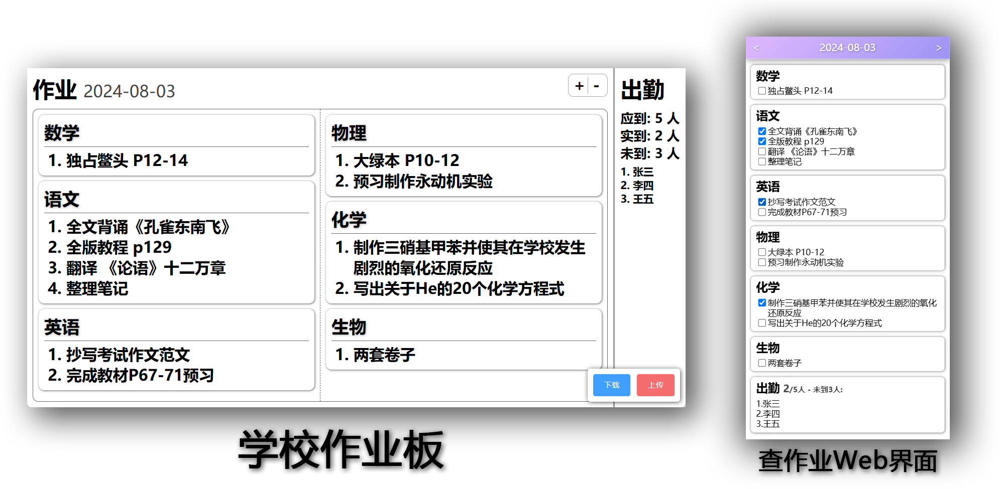

# 作业板

## 项目介绍
- 本项目分为三个部分：学校作业板，查作业界面，API服务端
- 学校作业板：`SchoolProject-release.zip`
  - 可以在班级内记录并排版清晰地展示作业
  - 可以快捷记录出勤情况(无此需求可以去掉这一板块)
  - 在学校电子白板上浏览器中运行
  - 可以使用微软手写输入法或拼音(如有实体键盘)快速录入作业
  - 可以进行云同步，关闭后打开可以恢复之前记录的作业
  - 支持自定义科目排版顺序、学生列表
- 查作业界面：`ClientProject-release.zip`
  - 在任何设备的浏览器中运行(需部署在服务器上通过ip或域名访问)
  - 可以方便查询当前作业以及历史作业
  - 可以查询出勤情况(无此需求可以去掉这一板块)
- API服务端：`APIServer-release.py`
  - 在任何可以运行Python的服务器运行
  - 若部署在公网服务器，请放行17312端口
  - 若部署在学校内网，上述均只能在学校内网访问

## 食用说明
以下为在Windows系统(Windows Server)下的使用方法，其他操作系统请各位大佬自行拉取仓库打包
本项目使用难度可能略高，如有疑问可通过邮箱联系 `Enderwolf006@gmail.com`

#### 准备工作

- 你需要准备一台学校内网或公网的Windows电脑/服务器
- 在服务器上安装Python3.8及以上版本 [点我下载](https://mirrors.aliyun.com/python-release/windows/python-3.8.9.exe)，安装时请勾选“添加 Python 到环境变量”(Add Python To Path)
- 安装好Python后，在命令行输入 `pip install flask`

#### 准备文件
- 下载右侧Releases中Latest版本的三个文件 `APIServer-release.py`  `ClientProject-release.zip` `SchoolProject-release.zip` 
- 解压其中的 `ClientProject-release.zip` `SchoolProject-release.zip` 

#### 配置文件
- 推荐使用vscode编辑 [点我查看如何下载](https://blog.csdn.net/lxyker/article/details/125761994)
- 在解压后的 `SchoolProject-release` 文件夹中打开 `config.json` 内部有详细的注释可自行修改
- 在解压后的 `ClientProject-release` 文件夹中打开 `config.json` 内部有详细的注释可自行修改

#### 部署服务端
目录下打开命令行执行：按住Shift右键该目录文件夹 -> 打开 powershell -> 选择 `在此处打开 PowerShell 窗口`
- 在 `SchoolProject-release` 目录下打开命令行执行 `py -m http.server 17313`
- 在 `ClientProject-release` 目录下打开命令行执行 `py -m http.server 17314`
- 在 `APIServer-release.py` 所在目录下打开命令行执行 `py APIServer-release.py`

#### 使用客户端
- 学校作业板: 浏览器访问 `http://localhost:17313`(若不在本地部署, 请将localhost换成服务器ip或域名)
- 查作业界面: 浏览器访问 `http://localhost:17314`(若不在本地部署, 请将localhost换成服务器ip或域名)

#### 快速部署指南
[点我跳转](https://github.com/fhz08/HomeworkBoard-Rapid-Deployment-WinServer)
## 开源协议

本软件遵循 `GPLv3` 开源协议，以下为该协议内容解读摘要:

* 可自由复制 你可以将软件复制到你的电脑，你客户的电脑，或者任何地方。复制份数没有任何限制
* 可自由分发 在你的网站提供下载，拷贝到U盘送人，或者将源代码打印出来从窗户扔出去（环保起见，请别这样做）。
* 可以用来盈利 你可以在分发软件的时候收费，但你必须在收费前向你的客户提供该软件的 GNU GPL 许可协议，以便让他们知道，他们可以从别的渠道免费得到这份软件，以及你收费的理由。
* 可自由修改 如果你想添加或删除某个功能，没问题，如果你想在别的项目中使用部分代码，也没问题，唯一的要求是，使用了这段代码的项目也必须使用 GPL 协议。
* 如果有人和接收者签了合同性质的东西，并提供责任承诺，则授权人和作者不受此责任连带。

